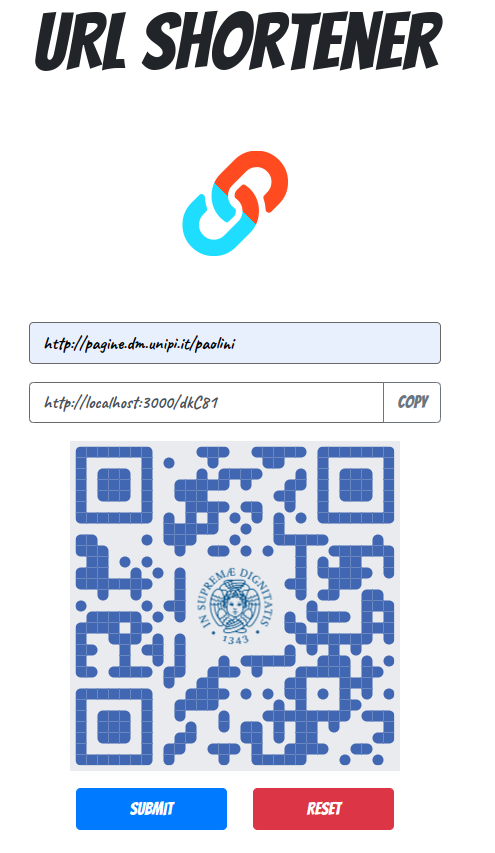

# URL Shortener 🔗
A simple web application built with Node.js, Express, and MongoDB for you to readily get a shortened URL to use

## Project First Look



## User Stories
1. User can input a set of URL aiming to be shortened
2. User can get a warning message for invalid URL format input
3. User can get a set of shortened URL from the original URL provided
4. User can copy the shortened URL to clipboard by clicking the copy button
5. User can reset the input columns for next URL generation 
6. User can be redirected to the original URL by visiting the shortened URL

## Admin Stories
1. Admin can configure validation of URLS to restrict urls redirections. Eg:
```
    export URL_SHORTENER_URL_REGEXP="^https?://[^/]*.mydomain.com(/.*|)$"
    export URL_SHORTENER_URL_ERROR_MESSAGE="url must refer to mydomain.com"
    export URL_SHORTENER_QR_IMAGE="https://url.to/image.png"
```
see file `controllers/convert.js` for more configuration settings.
___

## Installation
The following instructions will get you a copy of the project and all the setting needed to run it on your local machine.


### Prerequisites

- [npm](https://www.npmjs.com/get-npm)
- [Node.js v10.16.0](https://nodejs.org/en/download/)
- [MongoDB v4.0.10](https://www.mongodb.com/download-center/community)

### Clone

Clone this repository to your local machine

```
$ git clone git@github.com:Unipisa/url-shortener.git
```

### Setup

** Install npm packages**

```
$ npm install
```

** Start a database server**

```
$ docker-compose up -d
```

** Activate the web server**

```
$ npm run dev
```

** Wait the message for successful activation**

```
> mongodb connected!
> App is running: https://localhost:3000
```
Now you may visit the application on browser at URL: http://localhost:3000

### Docker

For production you can use the docker image https://hub.docker.com/r/paolini/url-shortener

___


## FAQ
- **Can I try this app online?**
    - Yes, kindly visit [https://go.dm.unipi.it/]
    - or the original (forked from) version [https://ancient-cove-62781.herokuapp.com/](https://ancient-cove-62781.herokuapp.com/)


___

## Authors

* original code: [Mike Huang](https://github.com/smallpaes)
* adapted by: [Emanuele Paolini](emanuele.paolini@gmail.com)
